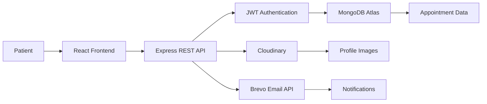
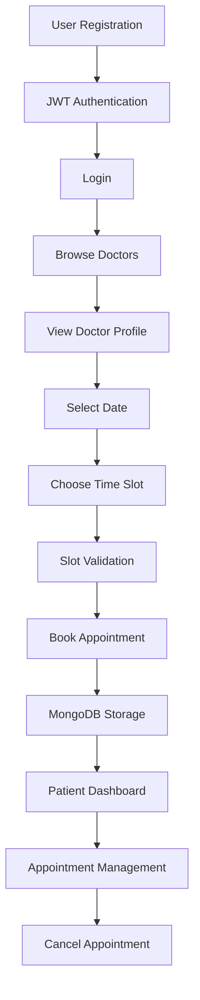
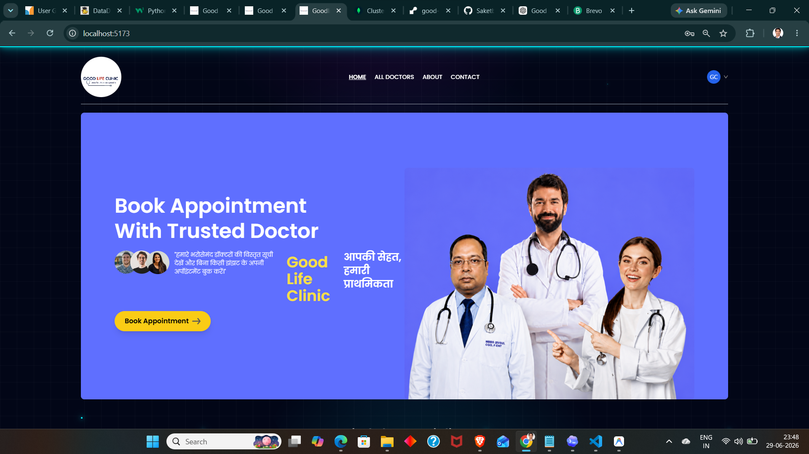
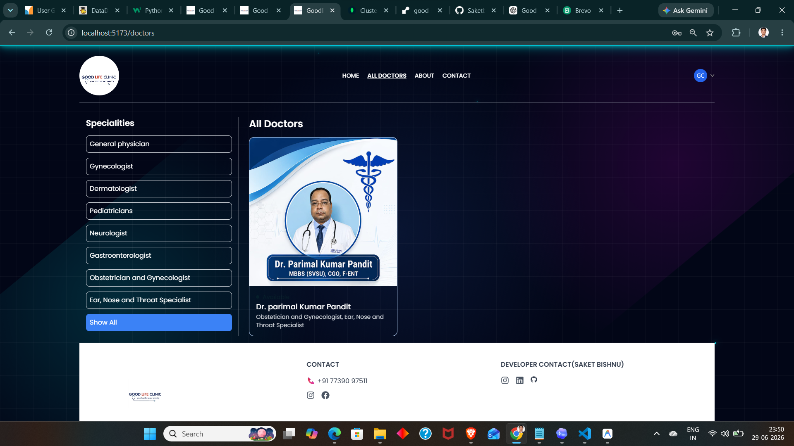
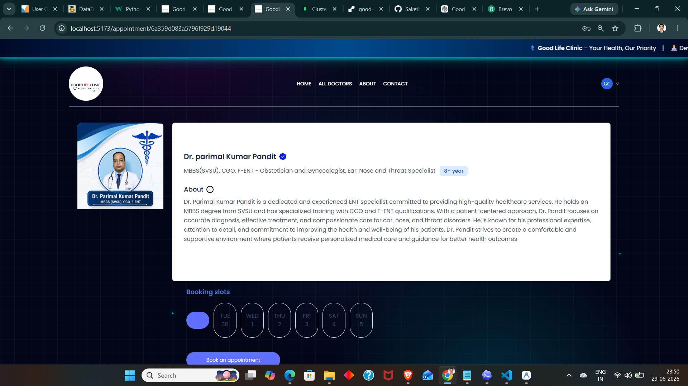
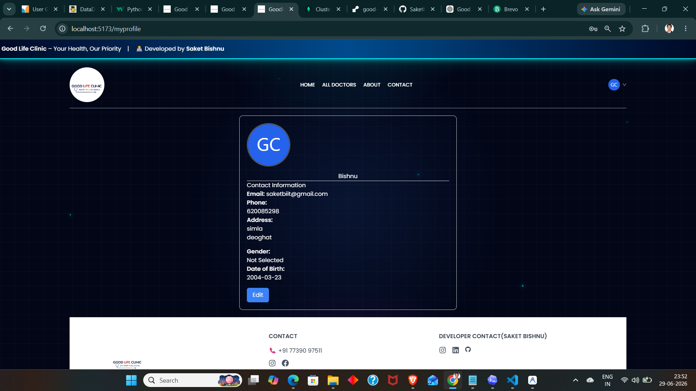
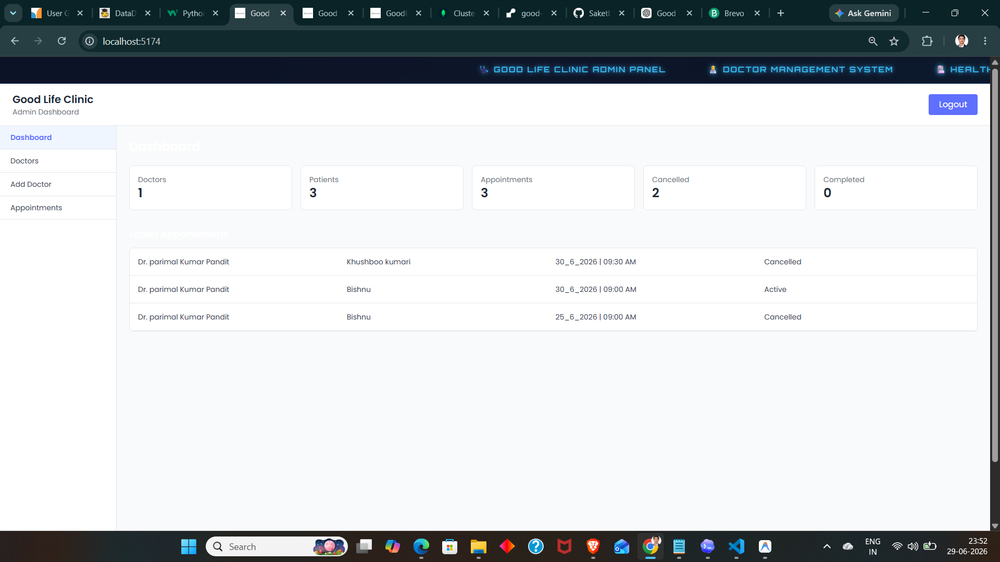

# 🌿 GoodLife Clinic — AI Powered Smart Healthcare Platform

<p align="center">


</p>

---

<p align="center">


</p>

---

<p align="center">


</p>

---

# 🌟 Overview

**GoodLife Clinic** is a modern, AI-ready healthcare management and doctor appointment booking platform developed using the **MERN Stack**. It digitizes the complete appointment workflow by providing secure authentication, real-time appointment scheduling, doctor management, cloud-based media storage, and a responsive user experience.

The platform has been designed with scalability, modular architecture, and security in mind so that it can evolve into a complete digital healthcare ecosystem.

---

# 🎯 Project Objectives

* Digitize the appointment booking process.
* Reduce manual scheduling conflicts.
* Provide patients with a simple healthcare experience.
* Give administrators centralized control over doctors and appointments.
* Build a scalable backend ready for future AI integration.
* Deliver a secure, cloud-hosted healthcare platform.

---

# 🚀 Key Features

## 👤 Patient Portal

* Secure User Registration
* JWT Authentication
* Login & Logout
* Profile Management
* Profile Photo Upload (Cloudinary)
* Browse Doctors
* Search Doctors by Specialty
* View Doctor Profiles
* Book Appointments
* Real-Time Slot Availability
* Prevent Double Booking
* View Appointment History
* Cancel Appointments
* Responsive Mobile Interface

---

## 👨‍⚕️ Doctor Management

* Doctor Profiles
* Professional Details
* Experience Information
* Consultation Fee
* Specialty Management
* Profile Image Upload
* Availability Toggle
* Appointment Visibility

---

## 🛠️ Admin Dashboard

* Secure Admin Login
* Add New Doctors
* Upload Doctor Images
* Manage Doctor Availability
* View All Doctors
* Monitor Patient Appointments
* Protected Admin APIs
* Dashboard Statistics Ready

---

## ☁️ Cloud Features

* MongoDB Atlas Database
* Cloudinary Image Storage
* Render Backend Deployment
* Vercel Frontend Deployment
* Brevo Email Integration
* RESTful API Architecture

---

# 🔐 Security Features

* JWT Authentication
* Password Hashing using bcrypt
* Protected API Routes
* Admin Authorization
* Input Validation
* Secure Environment Variables
* Cloud Image Storage
* CORS Protection

---

# ⚙️ Technology Stack

## Frontend

* React.js
* React Router DOM
* Context API
* Axios
* Tailwind CSS
* Vite

---

## Backend

* Node.js
* Express.js
* MongoDB
* Mongoose
* JWT
* bcrypt
* Validator
* Multer
* Cloudinary
* Brevo Email API

---

## Deployment

* Vercel (Frontend)
* Render (Backend)
* MongoDB Atlas
* Cloudinary
* Brevo

---

# 🏗️ System Architecture



---

# ⚡ Application Workflow



---

# 📂 Project Structure

```
Good-Life-Clinic
│
├── frontend
│   ├── components
│   ├── context
│   ├── pages
│   ├── assets
│   └── App.jsx
│
├── backend
│   ├── config
│   ├── controllers
│   ├── middleware
│   ├── models
│   ├── routes
│   ├── services
│   └── server.js
│
├── admin
│   ├── pages
│   ├── components
│   └── App.jsx
│
└── README.md
```

---

# 📸 Application Screenshots

## 🏠 Home Page

<p align="center">



</p>

---

## 👨‍⚕️ Doctors Page

<p align="center">



</p>

---

## 📅 Appointment Booking

<p align="center">



</p>

---

## 👤 Patient Dashboard

<p align="center">



</p>

---

## 🛠️ Admin Dashboard

<p align="center">



</p>

---

## 📱 Mobile Responsive Design

<p align="center">


</p>

---

# 🌱 Future Enhancements

* AI Symptom Checker
* AI Health Assistant
* WhatsApp Appointment Booking
* Online Video Consultation
* Payment Gateway Integration
* Doctor Ratings & Reviews
* Digital Medical Records
* Email Appointment Reminders
* SMS Notifications
* Forgot Password via Secure Email Link
* Email Verification
* Google Login
* Two-Factor Authentication (2FA)
* Multi-language Support
* Dark & Light Theme
* Analytics Dashboard
* Prescription Management
* Medical Report Upload
* QR Code Check-in
* Progressive Web App (PWA)
* Mobile Application (Android & iOS)

---

# 📈 Current Project Status

| Module                   | Status         |
| ------------------------ | -------------- |
| Patient Portal           | ✅ Completed    |
| Admin Dashboard          | ✅ Completed    |
| Doctor Management        | ✅ Completed    |
| JWT Authentication       | ✅ Completed    |
| Cloudinary Integration   | ✅ Completed    |
| Appointment Booking      | ✅ Completed    |
| Appointment Cancellation | ✅ Completed    |
| Responsive Design        | ✅ Completed    |
| Brevo Email Service      | ✅ Completed    |
| Production Deployment    | ✅ Completed    |
| Forgot Password          | 🚧 In Progress |
| AI Features              | 🔜 Planned     |

---

# 👨‍💻 Developer

**Saket Bishnu**

Software Engineer | MERN Stack Developer | Machine Learning Enthusiast

---

<p align="center">

⭐ If you found this project useful, consider giving it a star on GitHub!

</p>
